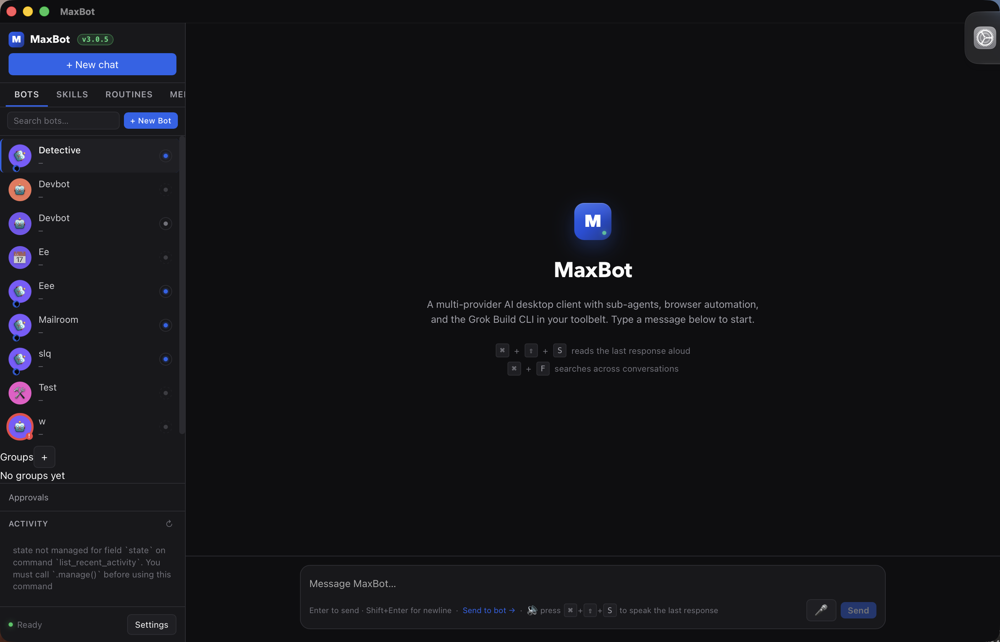
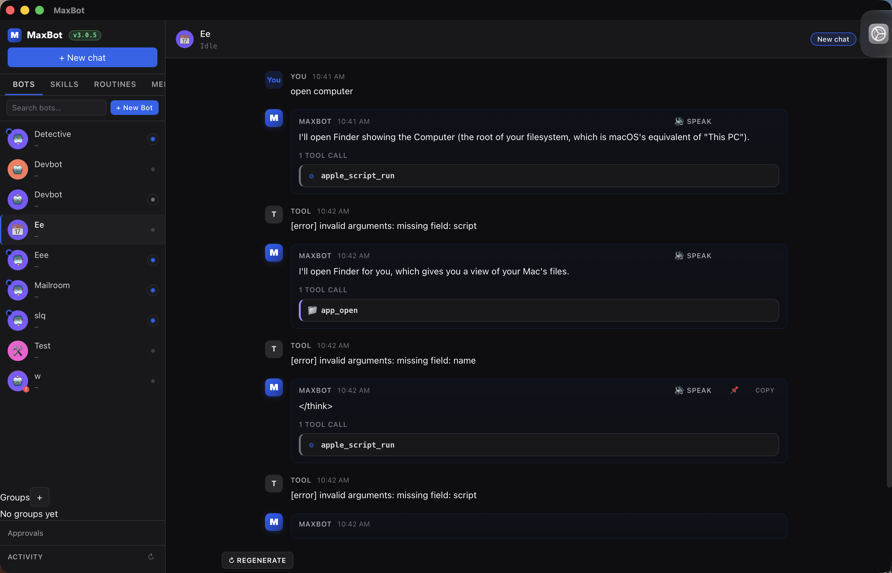
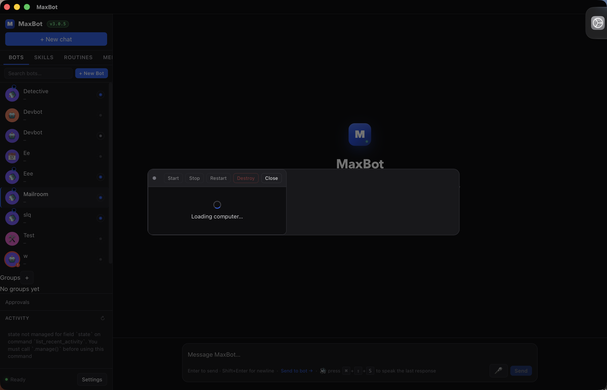
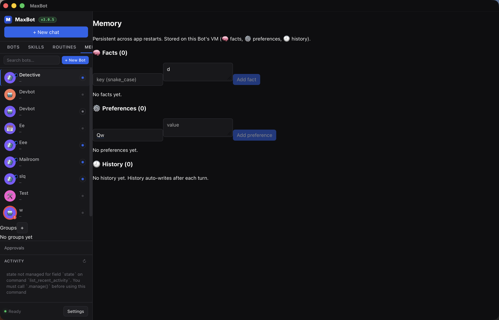
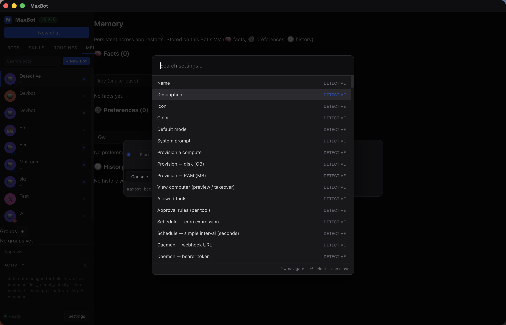

# MaxBot v3 — the grand tour

A panel-by-panel walkthrough of MaxBot v3, aimed at anyone seeing
the app for the first time — or anyone who already knows v2 and
wants a quick map of what changed. Read top-to-bottom for the
shape of the app, or jump to a section from the table of contents
below.

## Table of contents

1. [Overview](#overview)
2. [Sidebar](#sidebar) — Bot roster, version pill, ActivityFeed
3. [Bot Editor](#bot-editor) — Identity, Brain, Workspace, Computer, Capabilities, Rules, Schedule, Daemon
4. [Chat Panel](#chat-panel)
5. [Computer Panel](#computer-panel) — Status, Preview, Takeover + Files
6. [Skills Panel](#skills-panel)
7. [Memory Panel](#memory-panel)
8. [Approval Queue](#approval-queue)
9. [Routines Panel](#routines-panel)
10. [Activity Feed](#activity-feed)
11. [Settings Drawer](#settings-drawer) — and the <kbd>⌘</kbd>+<kbd>K</kbd> palette
12. ["What's new in v3" overlay](#whats-new-in-v3-overlay)
13. [Closing notes — the v3 polish theme](#closing-notes--the-v3-polish-theme)

---

## Overview

MaxBot v3 is a personal multi-provider AI desktop client with
**per-Bot Linux computers**, browser automation, and the
**maxbotd** headless daemon — all behind a polished, low-chrome
interface. It's a Tauri 2 app (Rust core, React 19 / Vite 6 /
TypeScript-strict renderer) that keeps conversations, Bots, and
their VMs on disk so a model can keep working across launches
without leaning on a server. v3 is the polish pass: a new color
palette, system fonts, tactile feedback, skeleton loaders, and an
ActivityFeed that survives a failed poll.


*Main app shell — sidebar on the left with the Bot roster
(Detective, Devbot, Eee, Mailroom, and the rest of the v3.0.5
test roster), the version pill in the sidebar footer, the
Activity feed at the bottom, and the MaxBot welcome screen in
the main panel. The v3 palette is Electric Blue on dark, with
system sans typography throughout.*

- The app is single-window (Tauri 2 native chrome). Closing the
  window quits the app; the per-Bot **maxbotd** daemons keep
  running on the Linux host.
- First launch on a new install shows the **onboarding** flow,
  then the **"What's new in v3"** overlay (see below).

---

## Sidebar

The sidebar is the home base. It always shows the **Bot roster**
(a list of your Bots, each with an avatar and a 6-state presence
indicator), a **New Bot** button at the top, and a footer with the
**version pill** and the **ActivityFeed** (last few system
events). Clicking a Bot in the roster opens its chat in the main
panel.


*Bot roster with three Bots — each card shows the avatar, name,
last-activity timestamp, and the colored presence dot (idle /
thinking / working / waiting / blocked / done). The footer
collapses to show only the version pill when the ActivityFeed is
empty. Screenshot pending — to be hand-captured by Tyler. See
v3.0.6 CHANGELOG note.*

- The version pill in the footer is colored by **release
  channel** (stable vs. nightly). It always matches the running
  app's `package.json` version, so you can tell at a glance
  whether the binary on disk matches what you're running.
- The ActivityFeed at the bottom shows the most recent
  background events (a Bot run finishing, a Computer VM state
  change, a Daemon rotation, etc.). Click any event to jump to
  the relevant panel.
- **Roster shortcuts:** <kbd>⌘</kbd>+<kbd>F</kbd> focuses the
  search box, <kbd>↑</kbd> / <kbd>↓</kbd> move the selection,
  <kbd>Enter</kbd> opens the selected Bot, <kbd>Delete</kbd>
  archives the Bot (destructive — confirms first).

---

## Bot Editor

The Bot Editor opens as a modal when you click **+ New Bot** in
the sidebar or click an existing Bot's **Edit** action. It's a
single scrolling form, broken into 8 sections, not a tabbed UI —
you scroll top-to-bottom and the section headings act as
navigation. Each section is collapsible, so on a re-edit you can
jump straight to the one you care about.


*Bot Editor modal — Identity section at the top, with the four
specialist template chips (Figma Bro, Devbot, Detective, Mailroom)
that fill in name + system prompt in one click. The remaining
sections (Brain, Workspace, Computer, Capabilities, Rules,
Schedule, Daemon) are below. Screenshot pending — to be
hand-captured by Tyler. See v3.0.6 CHANGELOG note.*

The eight sections:

### Identity
- Name, description, icon, color, and the four
  **specialist template chips** (Figma Specialist → "Figma Bro",
  Code Reviewer → "Devbot", Researcher → "Detective", Inbox
  Triage → "Mailroom"). Clicking a chip fills the Name placeholder
  + System Prompt; you can still edit before saving.

### Brain
- **System prompt** (the bot's persona + instructions) and
  **Default model** (overrides the global default for this Bot
  only). The system prompt supports a small set of inline
  templating — see the Bot editor's hint text.

### Workspace
- The Bot's **on-disk folder** (read-only display:
  `~/Library/Application Support/com.maxbot.app/bots/<id>/`).
  A "Reveal in Finder" button next to it. All of the Bot's
  per-Bot state (memory, skills, routines, run history) lives
  in this folder.

### Computer
- Check **Provision a computer** to give this Bot its own
  Linux VM on the server you configured in **Settings →
  Computer**. Pick a **RAM** (default 2048 MB) and **disk size**
  (default 10 GB) and MaxBot SSHes to the server, runs
  `virt-install` with a cloud-init seed, and waits for the
  libvirt DHCP lease. The section also shows a status dot for
  any existing VM and a **View computer** button that opens
  the [Computer Panel](#computer-panel) in Preview mode.

### Capabilities
- The per-tool toggles the Bot can call. The list is filtered
  to tools enabled in **Settings → Tools**; the per-Bot list
  can only narrow, not widen, the global set. A "**Voice**"
  sub-section sits here: enable per-Bot TTS and pick the voice
  (overrides the global `Samantha` default).

### Rules
- Per-Bot **auto-approve / ask / deny** rules for the tools
  that touch the outside world. Patterns are substring matches
  on the tool name or argument keys. "auto" runs immediately,
  "ask" queues into the [Approval Queue](#approval-queue),
  "deny" hard-blocks the call.

### Schedule
- **Interval** (every N seconds; 0 = manual only) and/or a
  5-field **cron expression** (cron takes precedence when both
  are set). The fastest practical cadence is 30 seconds — the
  scheduler wakes on a 30-second tick.

### Daemon
- The Bot's **bearer token** for the per-Bot **maxbotd** headless
  daemon (v2.8.0). Each Bot has its own daemon running on the
  Linux host; the token authenticates RPC calls to that daemon.
  **Rotate** regenerates and revokes the old token; the new one
  is shown once and never persisted in plaintext.

- All 8 sections share a single Save button at the bottom
  right. <kbd>⌘</kbd>+<kbd>Enter</kbd> saves and closes;
  <kbd>Esc</kbd> closes without saving.
- The **Settings** palette (<kbd>⌘</kbd>+<kbd>K</kbd>) indexes
  every field across every Bot, so a deep link to
  "Mailroom's Schedule" is one keystroke away from anywhere.

---

## Chat Panel

The main chat surface. One conversation stream per Bot — the
sidebar switches which Bot is active, and the chat panel shows
that Bot's conversation. Messages stream in via SSE; tool calls
and their results show as collapsible cards inline. The composer
is at the bottom.


*Chat with a realistic three-turn conversation: the user said
"open computer" and the assistant worked through it with
`apple_script_run` and `app_open` tool calls, including the
inline error cards when an argument was missing. The composer
at the bottom has the send / stop / TTS buttons; the
`Regenerate` button under the conversation re-sends the same
prompt.*

- <kbd>Enter</kbd> sends, <kbd>Shift</kbd>+<kbd>Enter</kbd> inserts
  a newline. While the assistant is streaming, the send button
  turns into a red **Stop** button.
- Hover any assistant message for **Copy** + **Regenerate** + per-
  message TTS. The last assistant response also gets a
  **Regenerate** bar right below it — click to delete the last
  turn and re-send the same prompt.
- The **Send to Bot** button in the composer header routes the
  current draft to a specific Bot (instead of the active one) —
  useful for "ask Detective to look this up" without losing your
  context in the current chat.

---

## Computer Panel

> **Note (v3.7.4):** the screenshots below are pre-v3.7.2 — the
> Computer Panel no longer renders a noVNC viewer. The v3.7.2
> display rework replaced the in-webview RFB stream with a
> host-side QEMU framebuffer poll (Preview) and macOS Screen
> Sharing via SSH tunnel (Takeover). See
> `docs/first-bot-20-minutes.md` (landed in v3.7.7) for the
> current flow. Screenshot regeneration is tracked as a
> separate follow-up; the text below is updated for the
> current behavior, but the images are stale.

The Computer Panel is the per-Bot VM surface, in three modes:

- **Status** — a tiny chip (icon + dot + uptime like `1h 2m`).
  Used in the title bar. Always on. Updates every 5 seconds.
- **Preview** — a pinned side panel (~30% width) showing a
  fresh JPEG of the QEMU framebuffer, polled by the host every
  300ms (`virsh screenshot` on the Linux server, piped back to
  the Mac over the existing SSH connection). The Bot keeps
  driving; you watch read-only by default.
- **Takeover** — full mouse + keyboard control via macOS Screen
  Sharing. MaxBot opens an `ssh -N -L <port>:127.0.0.1:<qemu-vnc>
  <user>@<host>` tunnel and hands the renderer
  `vnc://127.0.0.1:<port>`. macOS opens the Screen Sharing app
  against the loopback port. The Bot continues running; you take
  over the desktop. Click **Hand back to Bot** when you're done
  — the SSH child is killed and the Bot resumes control.

The loopback URL never contains the server's IP/hostname, so you
can share Preview links without leaking infra.


*Computer Panel in Preview mode (Console tab) — the Mailroom
Bot is selected, the panel's toolbar (Start / Stop / Restart /
Destroy / Close) is at the top, and the screenshot viewer is
bootstrapping. The "Loading computer..." state is the v3
skeleton-shimmer polish at work — the panel lays out the
correct shape and the content fills in once the first JPEG
comes back from `virsh screenshot`. (Screenshot is pre-v3.7.2
and shows the old noVNC canvas — the v3.7.7 doc will replace
this with a current shot.)*

### Files tab

The Computer Panel also has a **Files** tab — a file browser
over the Bot's VM filesystem, backed by SFTP. Browse, upload,
download, open in your local editor, delete. A breadcrumb at the
top shows the current path.


*Files tab — directory listing with breadcrumbs, per-file
size + modified timestamp, an "Upload" button in the toolbar,
and inline rename on click. The Console tab is a sibling tab
in the same panel. Screenshot pending — to be hand-captured by
Tyler. See v3.0.6 CHANGELOG note.*

- The Computer Panel polls `computerGet(botId)` every 5 seconds
  in Preview / Takeover mode, and subscribes to a
  `computer://state-changed` event for instant transitions
  (Start, Stop, Restart, Destroy).
- The toolbar (Start / Stop / Restart / Destroy) is disabled
  while the VM is in `provisioning` or `error` — both states
  are visible in the status chip.
- **Console tab vs Files tab:** the Console tab is the
  host-side screenshot preview of the desktop; the Files tab
  is the SFTP file browser. Both are part of the same panel —
  switch via the tab bar at the top.

---

## Skills Panel

The Skills Panel is per-Bot — each Bot has its own library of
recorded skills. A **skill** is a recorded sequence of
**ego-browser** (or other tool) calls that the Bot can replay on
demand. Click **Record new skill** to open the recorder, perform
the sequence in the preview, and save it with a name +
description. The next time the Bot needs to do that thing, it
calls the skill like any other tool.


*Skills Panel — a list of recorded skills for the active Bot,
each with name, description, last-used timestamp, and a Run /
Edit / Delete button. The "Record new skill" button at the top
right opens the recorder modal. Screenshot pending — to be
hand-captured by Tyler. See v3.0.6 CHANGELOG note.*

- Skills are stored as JSON files in the Bot's on-disk folder
  (see **Bot Editor → Workspace** above), so they're portable —
  you can copy a Bot's folder to another machine and its skills
  come with it.
- The Skills Panel is also reachable from the
  <kbd>⌘</kbd>+<kbd>K</kbd> palette — start typing the skill
  name to jump straight to it.

---

## Memory Panel

The Memory Panel is per-Bot. It shows two lists: **facts** (short
structured notes the Bot has written about you, your projects,
preferences) and **long-form notes** (longer markdown snippets).
The Bot reads these on every turn, so they're a low-friction way
to teach a Bot something persistent.


*Memory Panel — three sections, all per-Bot. 🧠 Facts at the
top (key/value, one-line entries, easy to add / edit / delete).
⚙️ Preferences in the middle (Q→V map the model reads on every
turn). 🕐 History at the bottom (auto-written per turn, the
panel is empty until the Bot's first conversation finishes).
Stored on the Bot's VM, persistent across app restarts.*

- Click **+ Add fact** to manually add a fact. The Bot also
  adds facts itself when it learns something new (visible in
  the **source** column — "user" vs. "bot").
- Long-form notes support markdown; click any note to edit it
  inline. A small "last edited" timestamp under each note
  tracks who changed it.
- The Memory Panel is reachable from <kbd>⌘</kbd>+<kbd>K</kbd>
  by typing "memory".

---

## Approval Queue

The Approval Queue is where tool calls that match a Bot's
**"ask"** rules (or that have no rule and require global consent)
land for human review. The queue is global — every Bot's
pending approvals show in one place, sorted oldest-first.


*Approval Queue — list of pending tool calls, each with the
Bot name, tool name, arguments (JSON, collapsible), a proposed
duration ("will take ~5s"), and Approve / Deny / Edit &
Approve buttons. Screenshot pending — to be hand-captured by
Tyler. See v3.0.6 CHANGELOG note.*

- **Approve** runs the call as-is. **Deny** rejects it (the Bot
  gets an error and can try a different approach).
  **Edit & Approve** lets you tweak the arguments (e.g. change
  a file path or a shell command) before approving.
- The queue persists across launches. A new install starts
  empty, but a busy day can stack up a dozen pending calls.
- A red badge in the sidebar shows the pending count — click
  it to jump to the queue.

---

## Routines Panel

The Routines Panel is per-Bot and surfaces the **scheduled runs**
for the Bot — the same data the **Bot Editor → Schedule** section
edits, but read-only with run history. Each routine shows its
schedule (cron expression + human-readable "every weekday at
9am"), last run timestamp, last run status, and a **Run now**
button to fire it ad-hoc.


*Routines Panel — list of the active Bot's scheduled runs,
with cron, next-fire timestamp, last-run status, and a Run-now
button per row. Screenshot pending — to be hand-captured by
Tyler. See v3.0.6 CHANGELOG note.*

- The **Run now** button doesn't affect the schedule — it just
  fires a one-off run. The next scheduled run is unchanged.
- If a run errors out, the row gets a red dot; click the row
  to see the error message and the last 50 lines of the Bot's
  output.

---

## Activity Feed

The Activity Feed is the global event stream — Bot runs starting
/ finishing, Computer VM state changes, Daemon token rotations,
Skills recorded, Memory updates, settings changes. It surfaces in
two places: the **bottom of the sidebar** (compact, last 5
events) and a dedicated **Activity Feed panel** (full history,
filterable by Bot + event type).


*Activity Feed — chronological list of system events. Each
event has an icon, a one-line description, a timestamp, and a
"jump to source" link. Filters at the top: by Bot, by event
type, by date range. Screenshot pending — to be hand-captured
by Tyler. See v3.0.6 CHANGELOG note.*

- **v3 specific:** the ActivityFeed keeps the **last good data**
  if a poll fails. The previous v2 behavior was to blank the
  feed on a network blip; v3 holds the last snapshot and shows
  a small "stale" badge on the feed so you know you're looking
  at cached data, not real-time.
- Click any event to jump to the relevant surface (the Bot's
  chat, the Computer panel, the Skill editor, etc.).

---

## Settings Drawer

The Settings Drawer slides in from the right when you click the
gear icon in the title bar, or hit <kbd>⌘</kbd>+<kbd>,</kbd>.
It's a tabbed modal with seven tabs: **General, Providers, TTS,
Browser, Computer, Tools, About.** Each tab is a vertical
scrolling form.


*Settings Drawer — General tab open, showing the LLM provider
dropdown, the active provider's API key field, the default
model field, the base URL override, and the global Computer
Use consent toggle. Tabs across the top: General, Providers,
TTS, Browser, Computer, Tools, About. Screenshot pending — to
be hand-captured by Tyler. See v3.0.6 CHANGELOG note.*

### The <kbd>⌘</kbd>+<kbd>K</kbd> palette (v3.0.2)

The big v3 quality-of-life win is the **settings command
palette**. Hit <kbd>⌘</kbd>+<kbd>K</kbd> (or
<kbd>Ctrl</kbd>+<kbd>K</kbd> on non-mac) from anywhere in the
app and a modal pops up with a search box. Start typing — the
palette filters every indexed setting across every Bot in your
roster, plus every App-level setting in the Settings drawer.
Hit <kbd>Enter</kbd> on a result and the palette:

1. Opens the right panel (the Bot editor, the Computer panel,
   the Settings drawer, etc.)
2. Focuses the matching field via its
   `data-setting-key` DOM attribute
3. Scrolls it into view

The bridge is one HTML attribute per field. The palette is
decoupled from any specific form — adding a new indexed field
is a one-line change.


*Command palette open over the Memory panel — every indexed
setting for the active Detective Bot is in the list (Name,
Description, Icon, Color, Default model, System prompt, the
Computer + Schedule + Daemon knobs, the Allowed tools /
Approval rules blocks). "Description" is the highlighted
result; Enter would open the Bot editor and focus that field.
Footer hints: ↑↓ navigate, ↵ select, esc close.*

- Substring match (case-insensitive) over label, context, and
  key. No fuzzy matching in v3.0.2 — the brief was explicit.
- The palette is **reachable from any view** — chat, home,
  group chat, the Bot editor itself. It mounts at the App
  level, not inside any panel.
- In the **home view** (no Bot selected) the palette filters
  App-level settings only; the per-Bot results appear once a
  Bot is active.

---

## "What's new in v3" overlay

The first time you launch v3 (after onboarding), a modal
summarizes the v3 polish so you have a mental anchor for the
change. Five bullets, ~5 seconds to read. Dismiss with the
**Got it** button, <kbd>Esc</kbd>, or a click on the backdrop —
MaxBot persists a `seen_v3_intro` flag in the `meta` table and
the overlay never reappears on subsequent launches.


*"What's new in v3" overlay — five bullets covering the v3
polish: Electric Blue palette, system sans fonts, tactile
button feedback, skeleton loaders, and the ActivityFeed
last-good-data behavior. Screenshot pending — to be
hand-captured by Tyler. See v3.0.6 CHANGELOG note.*

The five bullets, verbatim:

1. Brand palette: violet → **Electric Blue**.
2. Body font: Inter → **system sans** (no webfont download).
3. **Tactile button feedback** on every click.
4. **Skeleton shimmer** for loading states.
5. ActivityFeed **keeps last good data** if a poll fails.

If you dismiss the overlay too fast and want to re-read it, run
this from a terminal:

```bash
sqlite3 "$HOME/Library/Application Support/com.maxbot.app/maxbot.db" \
  "DELETE FROM meta WHERE key='seen_v3_intro';"
```

…then relaunch MaxBot.

---

## Closing notes — the v3 polish theme

v3 is the polish pass. The features are the same as v2.0–v2.9;
what changed is the *feel*. The full set of polish moves, in one
place:

- **Electric Blue palette** — the brand color moved from a
  violet-leaning primary to a sharper Electric Blue
  (`#2563eb`-ish). The active state, the focus ring, the Bot
  roster selection, and the "in-flight" indicators all use it.
- **System sans typography** — Inter (the webfont) is gone.
  Every text surface now uses macOS's system font stack (SF
  Pro on recent macOS, San Francisco on older, the platform
  default elsewhere). No network round-trip on launch, no FOUT,
  and the rendering matches the rest of the OS.
- **Tactile button feedback** — every button gets a brief scale
  + color shift on press, not just a hover state. The action
  feels physical; you can hear the click (metaphorically).
- **Skeleton shimmer for loading states** — instead of spinners,
  loading surfaces show a shimmer animation over the same
  layout they're about to render. The eye locks onto the right
  shape from the start; the content fills in.
- **ActivityFeed keeps last good data on a failed poll** — the
  previous behavior was to blank the feed on a network blip.
  v3 holds the last snapshot, shows a small "stale" badge, and
  resumes cleanly when the next poll succeeds. The data is
  honestly old, but you can still read it.
- **Anti-card overuse** — the v2.0 design was heavy on bordered
  cards everywhere. v3 pulls the borders back: surfaces are
  separated by whitespace and background tint, not by hard
  edges. The result is calmer and easier to scan.

If you're new to MaxBot, the recommended first session is: pick
one Bot (or create a "Spec" Bot with no computer), chat for a
few turns, save a fact in the Memory Panel, then hit
<kbd>⌘</kbd>+<kbd>K</kbd> and type "default model" to see the
palette in action. That single loop covers ~80% of the v3
surface.
